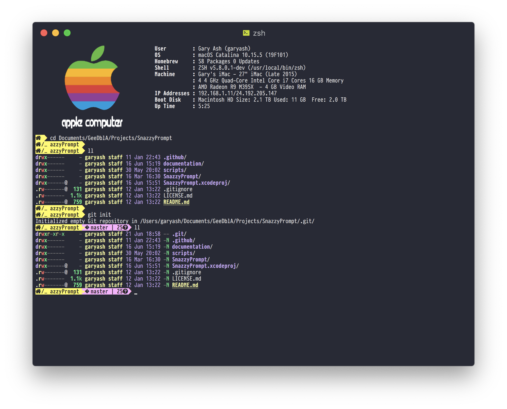

## Snazzy Powerline Style Terminal Prompt




This repository contains my snazzy [Powerline](https://powerline.readthedocs.io/en/latest/index.html) style terminal prompt

**Options Environment Variables:**.

Prompt looks at two environment variables depending on whether or not it detects that the terminal supports true (24-bit) color or simply XTerminal 256 color

SNAZZY\_PROMPT= 

SNAZZY\_PROMPT_TRUE=<Segment Name>,Foreground color,Background color[,Alternate Foreground color,Alternate Background color]:<next segment spec>

Color specifications are either an XTerminal 256 color table value or they follow a true color specification in the form of red <0 - 255>;green <0 - 255>;blue <0 - 255>

Segment Names:

*  *cwd* Current working directory
*  *err* Error status of the last command
*  *git* git status if the current directory is a git working tree
*  *machine* machine/host name
*  *user* user name

```zsh
#*****************************************************************************************
# prompt setup
#*****************************************************************************************
export SNAZZY_PROMPT="cwd,255,45,255,166:git,255,35,255,200:err,255,166"
export SNAZZY_PROMPT_TRUE="cwd,255;255;255,255;148;0,255;255;255,1:git,255;255;255,147;196;124,255;255;255,255;142;198:err,255;255;255,128;0;0"

snazzy_prompt_precmd() {
       PS1="$(/usr/local/bin/Prompt --error $?)"
}

install_snazzy_prompt_precmd() {
  for s in "${precmd_functions[@]}"; do
    if [ "$s" = "snazzy_prompt_precmd" ]; then
      return
    fi
  done
  precmd_functions+=(snazzy_prompt_precmd)
}
install_snazzy_prompt_precmd  
...  
```

# Building Prompt  

cd scripts
./build-libgit2.sh
open the Xcode project file and build
